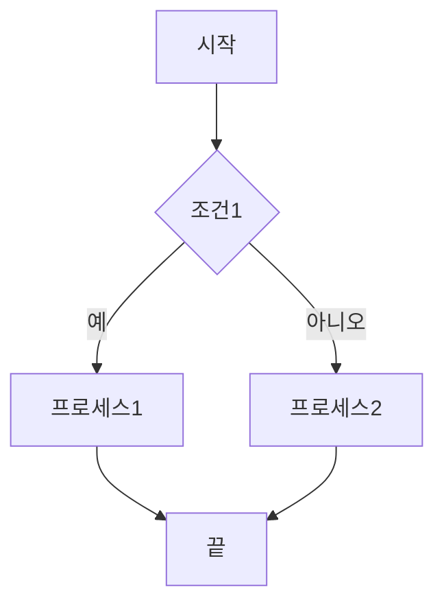
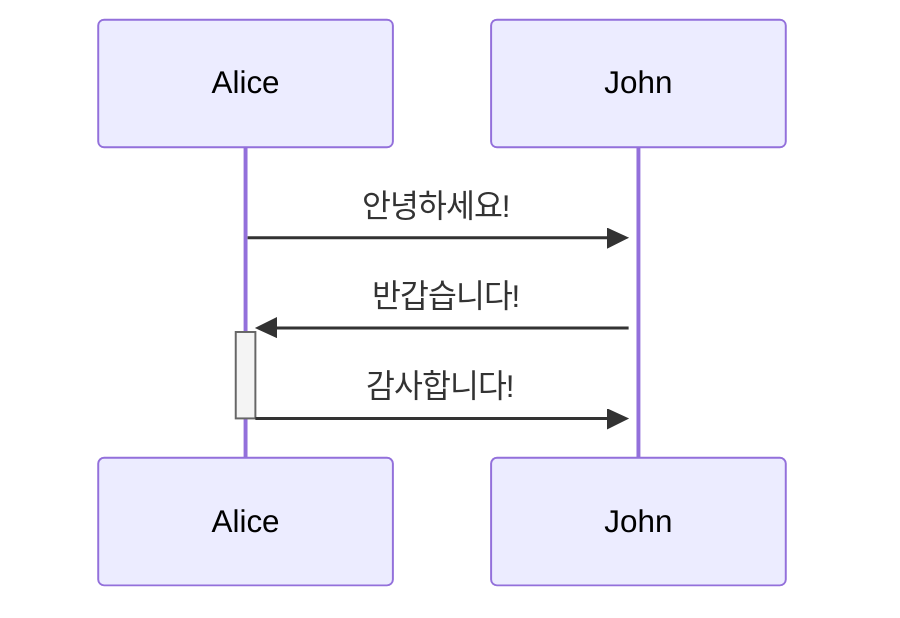
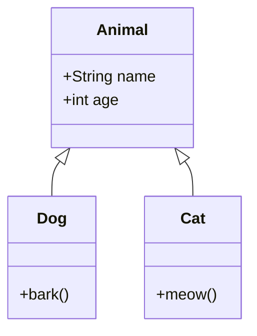
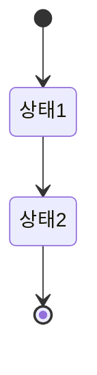
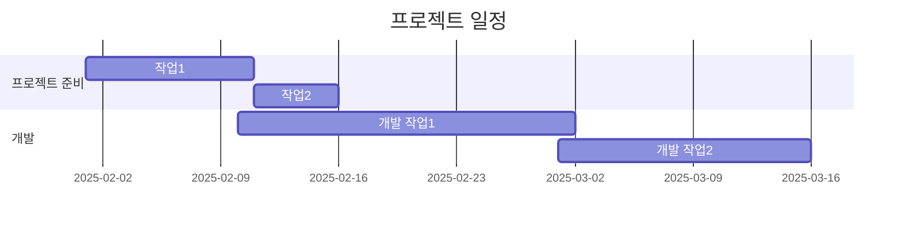
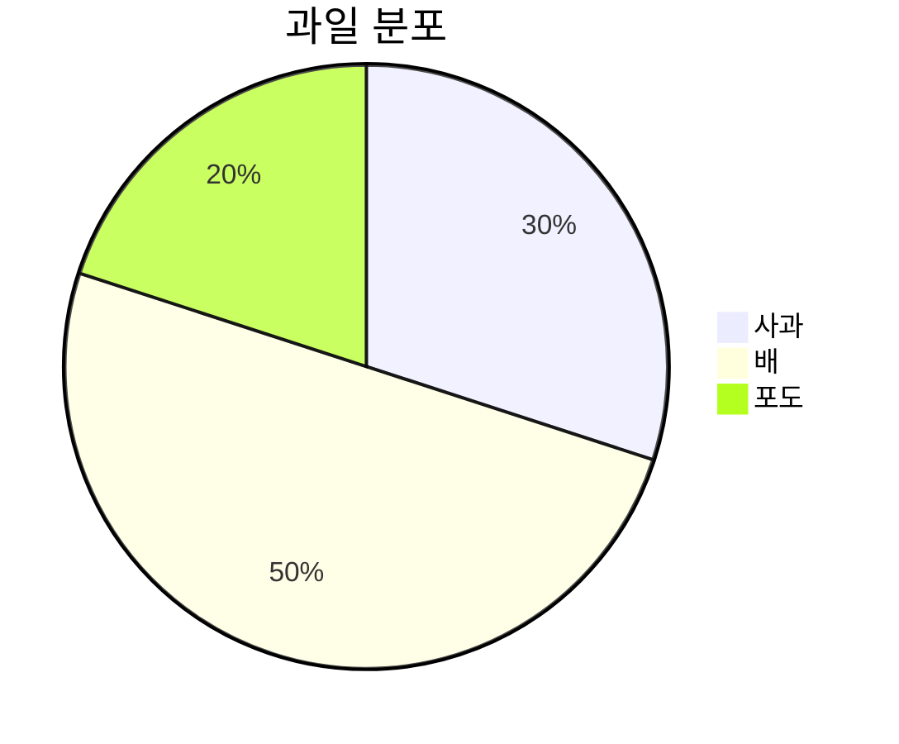

# Mermaid 다이어그램

Mermaid는 **텍스트 기반**으로 다이어그램을 생성할 수 있는 도구입니다. 마크다운 문서 내에서 다이어그램을 쉽게 생성할 수 있어, 기술 문서나 문서화 과정에서 유용하게 사용됩니다. Mermaid를 사용하면 복잡한 도표나 플로우차트를 코드처럼 간단하게 작성할 수 있으며, 여러 유형의 다이어그램을 지원합니다.

## 1. Mermaid 다이어그램의 특징

- **텍스트 기반**: 다이어그램을 그리기 위해 드래그앤드롭이나 복잡한 인터페이스를 사용할 필요 없이, 텍스트 코드만으로 다이어그램을 생성할 수 있습니다.
- **마크다운 호환**: Markdown 문서 내에서 다이어그램을 쉽게 삽입하고, GitHub, GitLab, Markdown 기반의 다양한 플랫폼에서 렌더링할 수 있습니다.
- **버전 관리 가능**: 코드로 작성된 다이어그램은 버전 관리 시스템(Git 등)에서 쉽게 관리할 수 있습니다.
- **다양한 다이어그램 유형 지원**: 플로우차트, 시퀀스 다이어그램, 클래스 다이어그램 등 다양한 형태의 다이어그램을 지원합니다.

## 2. Mermaid 다이어그램의 주요 유형

Mermaid는 다음과 같은 다양한 다이어그램을 지원합니다:

### 2.1. 플로우차트 (Flowchart)

플로우차트는 흐름을 나타내는 다이어그램으로, 단계별 프로세스를 시각적으로 표현할 수 있습니다.


### 2.2. 시퀀스 다이어그램 (Sequence Diagram)
시퀀스 다이어그램은 객체 간의 메시지 흐름을 시간 순서대로 나타냅니다.

### 2.3. 클래스 다이어그램 (Class Diagram)
클래스 다이어그램은 객체 지향 설계를 표현하는 데 사용됩니다. 클래스의 속성, 메서드 및 클래스 간의 관계를 시각적으로 표현할 수 있습니다.

### 2.4. 상태 다이어그램 (State Diagram)
상태 다이어그램은 시스템이 여러 상태를 어떻게 전이하는지 보여주는 다이어그램입니다.

### 2.5. Gantt 차트 (Gantt Chart)
Gantt 차트는 프로젝트 관리에서 일정 관리 및 작업 추적에 유용한 도구입니다.


### 2.6. 파이 차트 (Pie Chart)
파이 차트는 데이터를 비율로 시각화하는데 사용됩니다.


## 3. Mermaid 다이어그램 사용 방법
### 3.1. 마크다운에서 Mermaid 사용하기
Mermaid 다이어그램을 마크다운 파일에 삽입하려면 다음과 같이 mermaid 블록을 사용하여 다이어그램을 작성합니다.
```markdown
```mermaid
<다이어그램 코드>
```

### 3.2. 지원되는 플랫폼

Mermaid는 여러 플랫폼에서 지원됩니다. 예를 들어, 다음과 같은 플랫폼에서 Mermaid 다이어그램을 사용할 수 있습니다:
- **GitHub**: Mermaid를 이용한 다이어그램은 GitHub에서 자동으로 렌더링됩니다.
- **GitLab**: GitLab도 Mermaid를 지원하여, 마크다운 문서에 Mermaid 코드를 작성하면 다이어그램을 바로 볼 수 있습니다.
- **Markdown Editor**: 다양한 Markdown 에디터가 Mermaid를 지원하거나, 플러그인으로 Mermaid를 추가할 수 있습니다.

### 3.3. Mermaid Live Editor

Mermaid 다이어그램을 실시간으로 편집하고 결과를 확인할 수 있는 **Mermaid Live Editor**를 사용할 수 있습니다. [Mermaid Live Editor](https://mermaid-js.github.io/mermaid-live-editor/)를 이용하면 다이어그램을 작성하고, 생성된 코드와 다이어그램을 즉시 확인할 수 있습니다.

## 4. 결론

Mermaid는 간단한 텍스트 코드만으로 다양한 유형의 다이어그램을 생성할 수 있게 해주는 유용한 도구입니다. 마크다운 문서 내에서 다이어그램을 효율적으로 작성하고 관리할 수 있어, 기술 문서 작성 및 프로젝트 문서화 과정에서 매우 유용합니다. Mermaid의 텍스트 기반 접근 방식은 코드와 함께 다이어그램을 관리할 수 있게 해줍니다.
